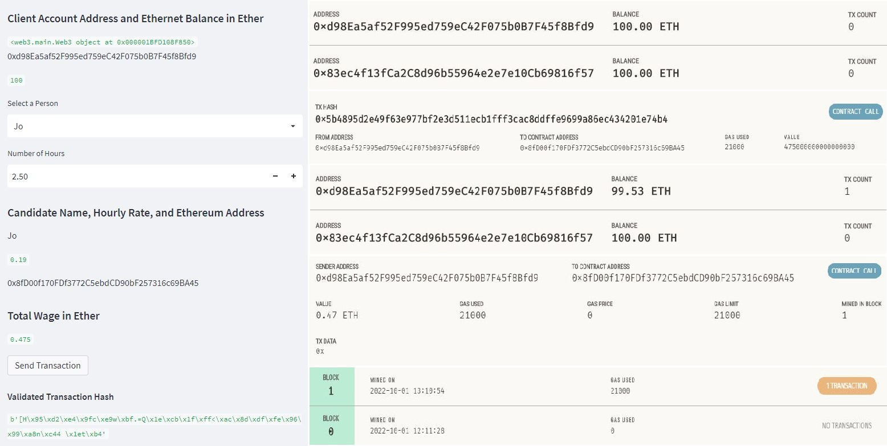

## Module 19 Challenge

In this project, a fintech finder application is integrated with the Ethereum blockchain network. The application is updated to include professional wages, hourly rates in ethereum, and send and sign transactions to the blockchain.  The transaction hash is returned and can be validated through Ganache personal blockchain.
---


## Technologies


This project uses Python 3.9.7 and the following libraries - 


| Library | Version | Documentation
|----|----|---|
| pandas |1.4.2| [pandas docs](https://pandas.pydata.org/docs)
| streamlit |1.12.0| [streamlit docs](https://docs.streamlit.io/)
| dataclasses | 0.8 | [dataclasses docs](https://docs.python.org/3/library/dataclasses.html)
| mnemonic | 0.2 | [mnemonic docs](https://pypi.org/project/mnemonic/)
| web3 | 5.17.0 | [web 3 docs](https://web3py.readthedocs.io/en/stable/)
| bip44 | 0.1.2 | [bip44 docs](https://pypi.org/project/bip44/)


---


## Installation Guide


```
pip install streamlit

pip install web3==5.17

pip install mnemonic

pip install bip44

streamlit run pychain.py
```


---

## Usage

The following images shows a fintch professional being selected, a transaction being sent. We can see the clients account listed on the right.  The transaction information is also shown along with the updated trnsaction count and block history.

<p align="center"></p>


## Contributors

Dan McQueen

dandmcqueen@gmail.com

[Linkedin](https://www.linkedin.com/in/dan-mcqueen-4a5980238/)

---


## License

[GNU v3.0](LICENSE)
